# Lms App - Complete Workflow Diagrams & Charts

## 🏗️ System Architecture Overview

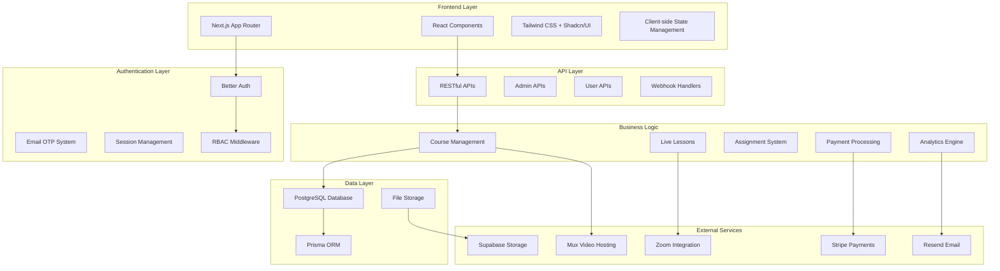

## 👥 User Role Hierarchy & Permissions

```mermaid
graph TD
    A[User Roles] --> B[🔴 ADMIN]
    A --> C[🟠 MANAGER]
    A --> D[🟡 TEACHER]
    A --> E[🟢 STUDENT]
    
    B --> B1[Full System Control]
    B --> B2[User Management]
    B --> B3[System Settings]
    B --> B4[All Analytics]
    B --> B5[Course Management]
    B --> B6[Live Lessons]
    
    C --> C1[Business Operations]
    C --> C2[Course Creation/Edit]
    C --> C3[Live Lessons]
    C --> C4[Course Analytics]
    C --> C5[User Enrollment]
    
    D --> D1[Live Lesson Management]
    D --> D2[Course Viewing]
    D --> D3[Assignment Grading]
    D --> D4[Student Progress]
    
    E --> E1[Course Access]
    E --> E2[Assignment Submissions]
    E --> E3[Progress Tracking]
    E --> E4[Live Lesson Attendance]
```

## 🔐 Authentication & Authorization Flow

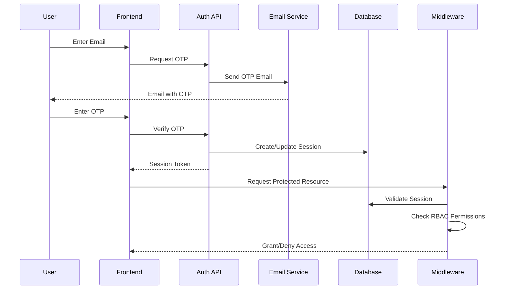

## 💰 Payment & Enrollment Workflow

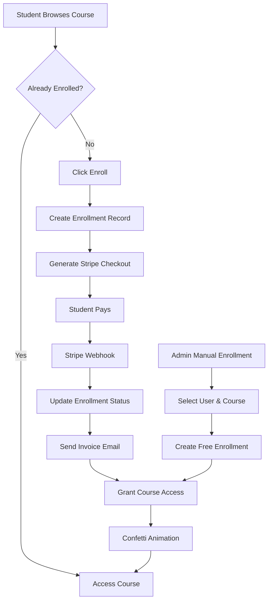

## 🎓 Course Learning Journey

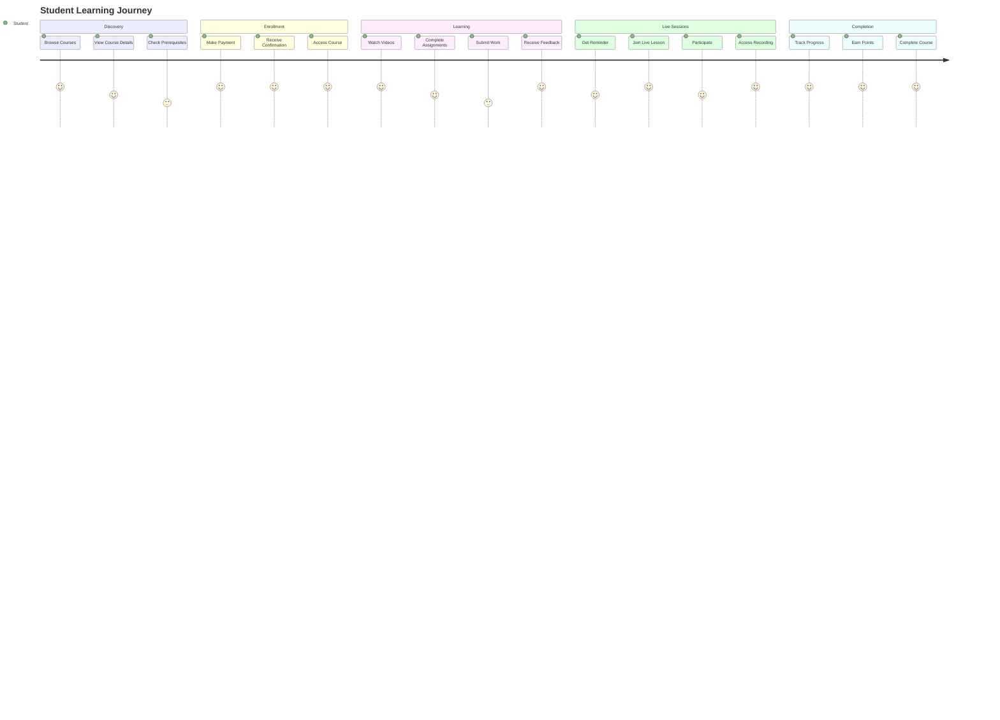

## 🎥 Live Lesson Management Flow

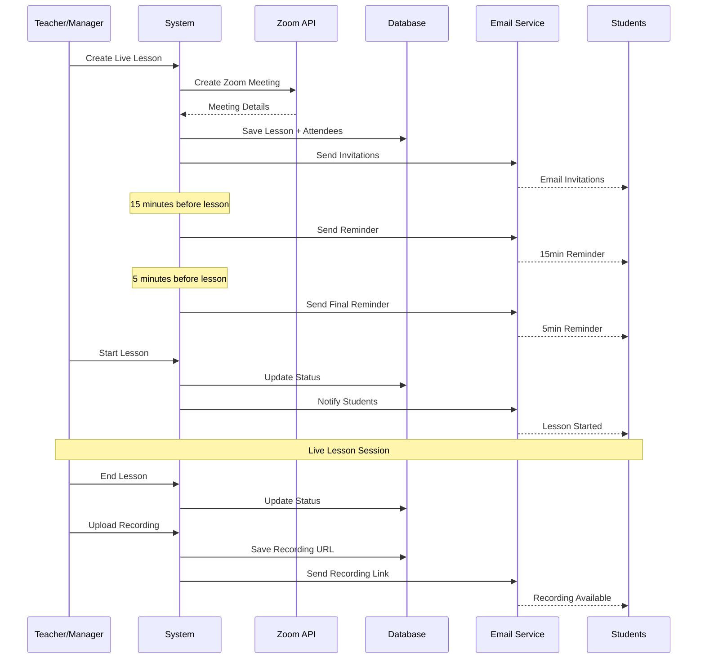

## 📊 Analytics & Reporting System

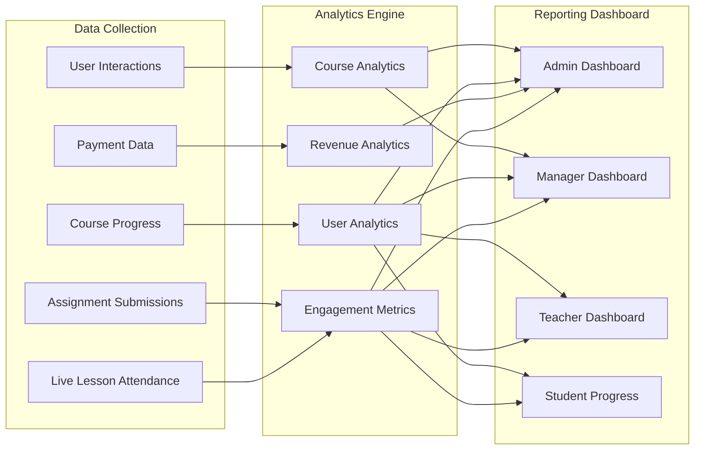

## 🗄️ Database Schema Relationships

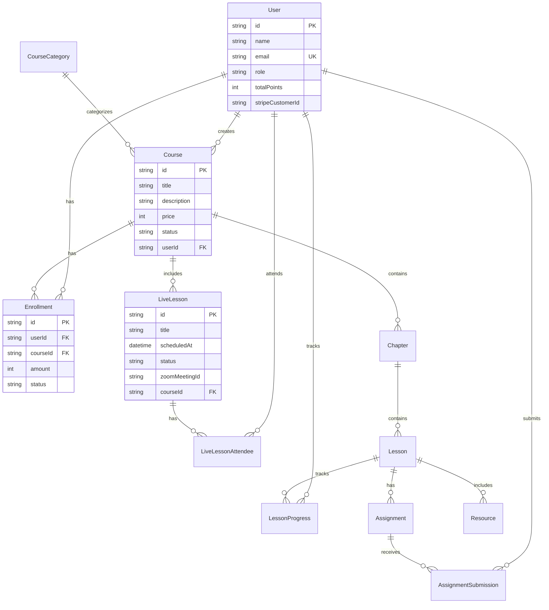

## 🔄 Content Management Workflow

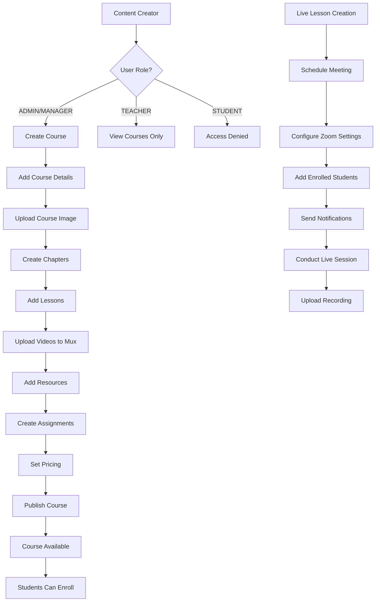

## 📧 Email Notification System

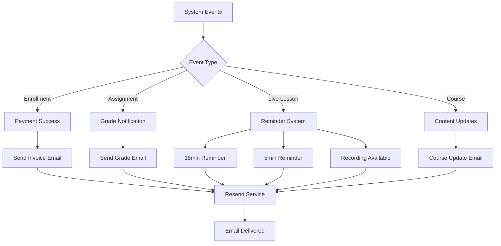

## 🛡️ Security & Access Control

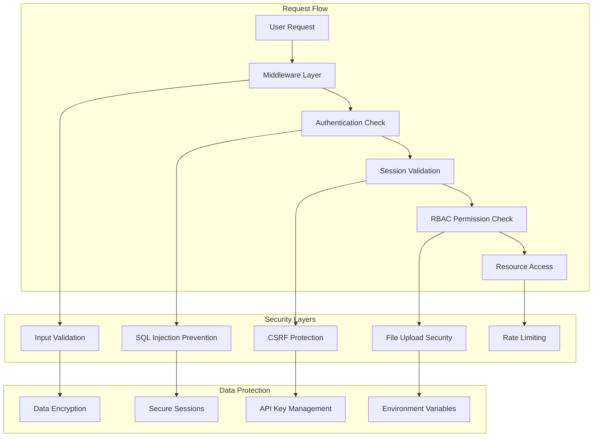

## 🚀 Deployment Architecture

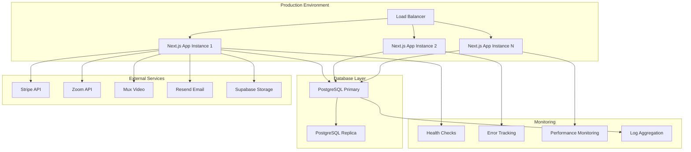

## 📱 Mobile-First User Experience

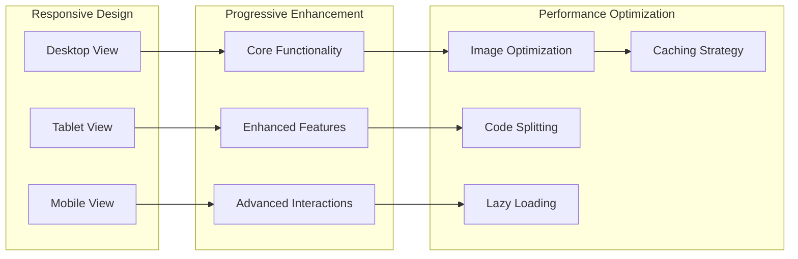

---

## 📈 Key Performance Indicators (KPIs)

### Student Engagement Metrics
- Course completion rates
- Average time spent per lesson
- Assignment submission rates
- Live lesson attendance
- Video engagement duration

### Business Metrics
- Monthly recurring revenue (MRR)
- Customer acquisition cost (CAC)
- Course enrollment conversion rates
- User retention rates
- Average revenue per user (ARPU)

### Technical Metrics
- Page load times
- API response times
- Error rates
- Uptime percentage
- Database query performance

### Content Performance
- Most popular courses
- Video completion rates
- Assignment difficulty analysis
- Live lesson engagement
- Resource download rates

---

*This comprehensive workflow documentation covers all major aspects of the LMS APPsystem, from user authentication to content delivery and analytics.*
